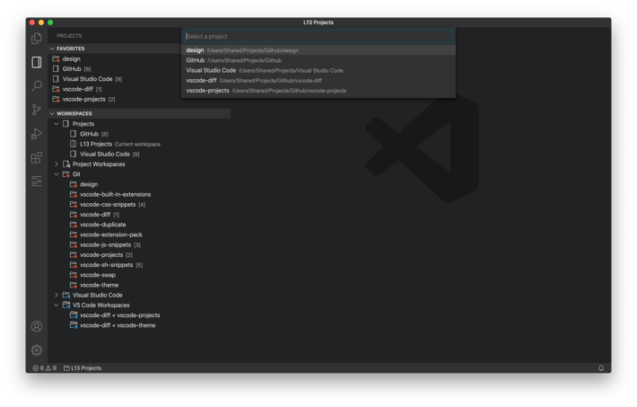
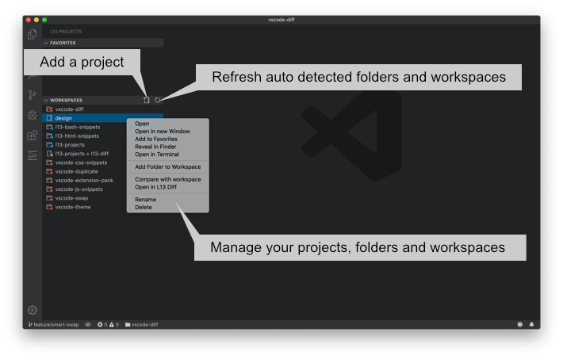
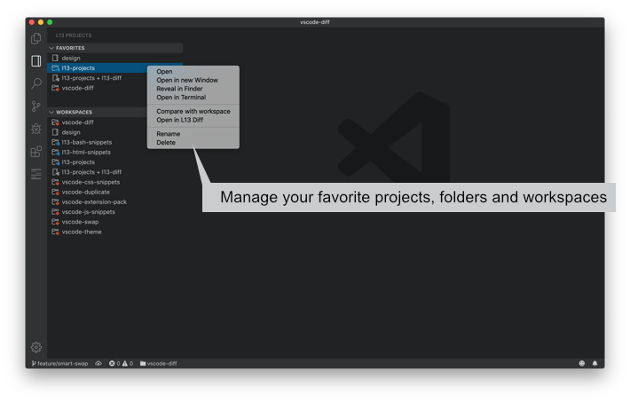
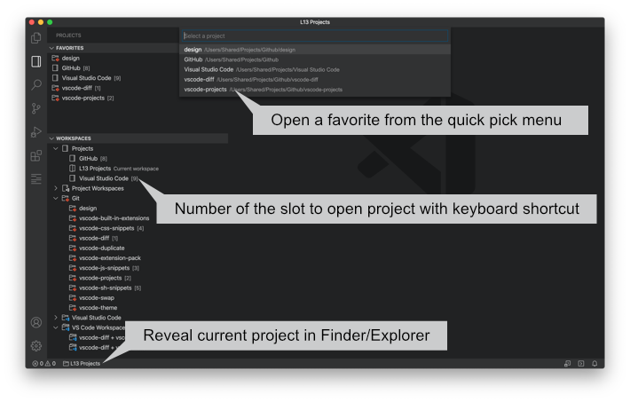
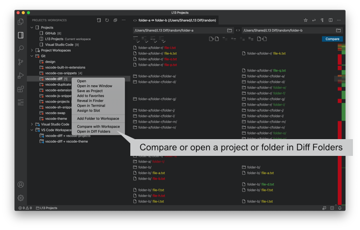
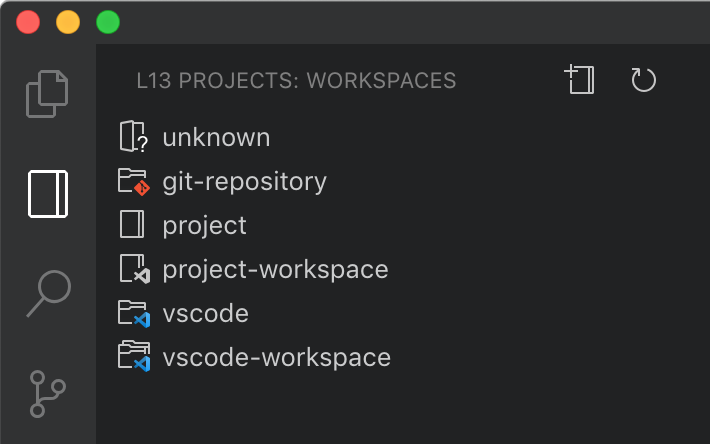

# Projects

Manage your workspaces and projects in Visual Studio Code.

## What's new in Projects 0.14.0

- Added message to empty workspace view.
- Added save dialog to unknown worspace.
- Added `l13Projects.sortWorkspacesBy` to group and sort workspaces.
- Added `l13Projects.initialWorkspacesGroupState` to set the initial state of the workspaces groups.

## Features

* Supports extension [Diff Folders](https://marketplace.visualstudio.com/items?itemName=L13RARY.l13-diff)
* Add folders and workspaces to the project list.
* Save the current folder or workspace in the project list.
* Auto detects Git repositories, VS Code folders and VS Code workspaces.
* Save auto detected Git repositories, VS Code folders and VS Code workspaces in the project list.
* Add projects, Git repositories, VS Code folders and VS Code workspaces to favorites.
* Open and pick a (favorite) folder, workspace or project with the quick menu.
* Open a folder, workspace or project in  the current or a new window in VS Code Explorer or Projects.
* Reveal a folder or workspace in the Finder/Explorer.
* Open a project, Git repository, VS Code folder or VS Code workspace in the Terminal.
* Delete or rename a favorite or project.
* Status bar shows current workspace name and opens the current folder or workspace in the Finder/Explorer.
* Cache detected folders and workspaces between sessions.
* Sort workspaces by name, type or simple group.

### Workspaces

### Favorites

### Quick Pick for Favorites or Projects

### Supports [Diff Folders](https://marketplace.visualstudio.com/items?itemName=L13RARY.l13-diff)

### Legend of used Icons

Priority of icons and labels for saved projects and detected folders and workspaces.

1. project / project-workspace
1. git-repository
1. vscode / vscode-workspace

## Available Commands

* `l13Projects.addProject` - Add folders and workspaces to the project list by dialog.
* `l13Projects.saveProject` - Save the folder or workspace in the project list.
* `l13Projects.clearProjects` - Delete all saved projects in the project list.
* `l13Projects.clearFavorites` - Delete all favorites.
* `l13Projects.pickFavorite` - Open the quick menu and pick a favorite.
* `l13Projects.pickProject` - Open the quick menu and pick a project.
* `l13Projects.refreshProjects` - Refresh all detected folders and workspaces.

## Available Settings

* `l13Projects.openInNewWindow` - If true click on project or click in quick menu opens folder or workspace in new window. Default value is false.
* `l13Projects.useCacheForDetectedProjects` - If true detected folders and workspaces will be stored  between window sessions. Default value is false.
* `l13Projects.git.folders` - The folders to search for Git repositories.
* `l13Projects.git.maxDepthRecursion` - The maximum depth of folder recursion for Git repositories.
* `l13Projects.git.ignore` - The folders which will be ignored for search.
* `l13Projects.vsCode.folders` - The folders to search for VS Code projects.
* `l13Projects.vsCode.maxDepthRecursion` - The maximum depth of folder recursion for VS Code projects.
* `l13Projects.vsCode.ignore` - The folders which will be ignored for search.
* `l13Projects.workspace.folders` - The folders to search for VS Code workspaces.
* `l13Projects.workspace.maxDepthRecursion` - The maximum depth of folder recursion for VS Code workspaces.
* `l13Projects.workspace.ignore` - The folders which will be ignored for search.
* `l13Projects.sortWorkspacesBy` - Sort workspaces by name, simple or type. 
	* `Name` - (default) Sort all workspaces by name.
	* `Simple` - Group all workspaces by simple type. 
	* `Type` - Group all workspaces by type. 
* `l13Projects.initialWorkspacesGroupState` - Set the initial state of a group.
	* `Remember` - (default) Remember the collpased and expanded state of each group.
	* `Collapsed` - Show all groups collapsed at start.
	* `Expanded` - Show all groups expanded at start.

## Global Keyboard Shortcuts

macOS

* `Cmd + L Cmd + P` - Open the projects view.
* `Cmd + Alt + P` - Open the quick menu to pick a favorite.
* `Cmd + Alt + Shift + P` - Open the quick menu to pick a project.

Windows / Linux

* `Ctrl + L Ctrl + P` - Open the projects view.
* `Ctrl + Alt + P` - Open the quick menu to pick a favorite.
* `Ctrl + Alt + Shift + P` - Open the quick menu to pick a project.

If the key bindings don't work, please check `Preferences -> Keyboard Shortcuts`.

## Favorites

* `Click` - Open a favorite folder, workspace or project. If `l13Projects.openInNewWindow` is true the project opens in a new window.

### Context menu

* `Open` - Open the favorite project in the current window. Ignores `l13Projects.openInNewWindow`.
* `Open in new Window` - Open the favorite project in a new window. Ignores `l13Projects.openInNewWindow`.
* `Open in Terminal` - Opens the favorite project in the VS Code terminal.
* `Compare with Workspace` - Compares the favorite project with the current workspace. Requires [Diff Folders](https://marketplace.visualstudio.com/items?itemName=L13RARY.l13-diff).
* `Open in Diff Folders` - Opens the favorite project in Diff Folders. Requires [Diff Folders](https://marketplace.visualstudio.com/items?itemName=L13RARY.l13-diff).
* `Rename` - Change the name of the favorite.
* `Delete` - Delete the favorite project from favorites.

macOS

* `Reveal in Finder` - Opens the favorite project in the finder.

Windows

* `Reveal in Explorer` - Opens the favorite project in the explorer.

Linux

* `Open Containing Folder` - Opens the favorite project in the file manager.

## Workspaces

* `Click` - Open a folder, workspace or project. If `l13Projects.openInNewWindow` is true the project opens in a new window.

### Context menu

* `Open` - Open the folder, workspace or project in the current window. Ignores `l13Projects.openInNewWindow`.
* `Open in new Window` - Open the folder, workspace or project in a new window. Ignores `l13Projects.openInNewWindow`.
* `Save Project` - Save the folder or workspace as a project.
* `Add to Favorites` - Add the folder, workspace or project to the favorites.
* `Open in Terminal` - Open the folder, workspace or project in the terminal.
* `Compare with Workspace` - Compares the folder, workspace or project with the current workspace. Requires [Diff Folders](https://marketplace.visualstudio.com/items?itemName=L13RARY.l13-diff).
* `Open in Diff Folders` - Opens the folder, workspace or project in Diff Folders. Requires [Diff Folders](https://marketplace.visualstudio.com/items?itemName=L13RARY.l13-diff).
* `Rename` - Change the name of a project.
* `Delete` - Delete the project.

macOS

* `Reveal in Finder` - Opens the folder or VS Code workspace file in the Finder.

Windows

* `Reveal in Explorer` - Opens the folder or VS Code workspace file in the Explorer.

Linux

* `Open Containing Folder` - Opens the folder or VS Code workspace file in the file manager.

## Quick Menu for Favorites

* `Click` - Open a favorite folder, workspace or project. If `l13Projects.openInNewWindow` is true the project opens in a new window.

## Quick Menu for Projects

* `Click` - Open a folder, workspace or project. If `l13Projects.openInNewWindow` is true the project opens in a new window.

## Statusbar

* `Click` - Reveal the current folder or workspace file in the Finder/Explorer.

## VS Code Explorer

### Context Menu

* `Open in current Window` - Opens the selected file or folder in the current VS Code Window.
* `Open in new Window` - Opens the selected file or folder in a new VS Code Window.

> This extension is part of the [L13 Extension Pack](https://marketplace.visualstudio.com/items?itemName=L13RARY.l13-extension-pack).