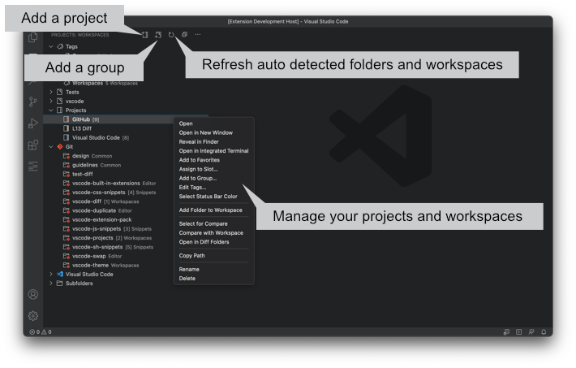

# Projects

Manage your workspaces and projects in Visual Studio Code.

## Important Notice

> The current version is a beta because it is not possible to test all types of remote workspaces. If something unexpected appears, please open an issue on GitHub.
> Remote workspaces do not support auto remove. Instead of a local file system, there is no guarantee that it will be always available to check if the folder still exists.

## What's new in Projects 2.0.0 Beta

- Added support for remote workspaces.
- Added sort workspaces by root.
- Added actions for reveal folder in os, show favorites, workspaces or tags to statusbar icons.

## Index

1. [Features](#features)
1. [Available Commands](#available-commands)
1. [Available Settings](#available-settings)
1. [Mouse and Keyboard Shortcuts](#mouse-and-keyboard-shortcuts)
1. [Local vs. Remote Workspaces](#local-vs-remote-workspaces)
1. [Workspace Trust](#workspace-trust)
1. [Recommended Extensions](#recommended-extensions)

## Features

* Supports extension [Diff Folders](https://marketplace.visualstudio.com/items?itemName=L13RARY.l13-diff)
* Auto detects Git repositories, Visual Studio Code folders and workspace files.
* Add folders and Visual Studio Code workspace files to the project list.
* Save the current workspace in the project list.
* Save auto detected Git repositories, Visual Studio Code folders and workspace files as projects.
* Add projects, Git repositories, Visual Studio Code folders and workspace files to favorites.
* Open and pick a (favorite) workspace in the (favorite) quick pick menu.
* Open a workspace in the current or a new window in Visual Studio Code Explorer or Projects.
* Reveal a workspace in the Finder/Explorer.
* Open a workspace in the Terminal.
* Cache detected folders and workspaces between sessions.
* Sort workspaces by name, category or type.
* Add custom groups to organize your favorites and workspaces.
* Assign a workspace or group to a slot to open it with a keyboard shortcut.
* Organize your workspaces with tags.
* Select a color for a project which also changes the status bar color of the workspace.

### Workspaces

### Quick Pick, Tags and Keyboard Shortcuts

### Status Bar Colors

### Supports the Extension [Diff Folders](https://marketplace.visualstudio.com/items?itemName=L13RARY.l13-diff)

### Icons

Priority of icons and labels for saved projects and detected folders and workspaces.

1. project / project-workspace
1. git-repository
1. vscode / vscode-workspace
1. subfolder

## Available Commands

* `Save Project` - Save the detected folder or workspace in the project list.
* `Delete All Projects` - Delete all saved projects in the project list.
* `Delete All Tags` - Delete all tags.
* `Delete All Favorites` - Delete all favorites.
* `Open Favorite Workspace` - Open the quick menu and pick a favorite.
* `Open Workspace` - Open the quick menu and pick a workspace.
* `Slot 1 .. 9` - Open a workspace assigned to a slot.
* `Clear Slot` - Clear a slot.
* `Clear All Slots` - Clear all slots.
* `Go to previous Workspace` - Open the previous active workspace.

macOS

* `Add Project` - Add folders and Visual Studio Code workspace files to the project list by dialog.

Windows / Linux

* `Add Project` - Add folders to the project list by dialog.
* `Add Project Workspace` - Add Visual Studio Code workspace files to the project list by dialog.

## Available Settings

* `l13Projects.openInNewWindow` - If true click on project or click in quick menu opens folder or workspace in new window. Default value is false.
* `l13Projects.useCacheForDetectedProjects` - If true detected folders and workspaces will be stored between window sessions. Default value is false.
* `l13Projects.git.folders` - The folders to search for Git repositories.
* `l13Projects.git.maxDepthRecursion` - The maximum depth of folder recursion for Git repositories.
* `l13Projects.git.ignore` - The folders which should be ignored. Supports `*` and `?` for names.
* `l13Projects.vsCode.folders` - The folders to search for Visual Studio Code folders.
* `l13Projects.vsCode.maxDepthRecursion` - The maximum depth of folder recursion for Visual Studio Code folders.
* `l13Projects.vsCode.ignore` - The folders which should be ignored. Supports `*` and `?` for names.
* `l13Projects.workspace.folders` - The folders to search for Visual Studio Code workspace files. Remote workspace files are not supported by Visual Studio Code.
* `l13Projects.workspace.maxDepthRecursion` - The maximum depth of folder recursion for Visual Studio Code workspace files.
* `l13Projects.workspace.ignore` - The folders which should be ignored. Supports `*` and `?` for names.
* `l13Projects.subfolder.folders` - The folders to search for subfolders.
* `l13Projects.subfolder.ignore` - The folders which should be ignored. Supports `*` and `?` for names.
* `l13Projects.confirmOpenMultipleWindows` - If true `Open All` and `Open All in New Windows` shows a dialog if more than 3 workspaces will be opened at once.
* `l13Projects.confirmDeleteFavorite` - If false confirm dialog for deleting favorites does not appear.
* `l13Projects.confirmDeleteProject` - If false confirm dialog for deleting projects does not appear.
* `l13Projects.confirmDeleteTag` - If false confirm dialog for deleting tags does not appear.
* `l13Projects.autoRemoveDeletedProjects` - If true deleted projects and favorites will be removed  automatically on reload or if cache for workspaces is false.
* `l13Projects.showTagsInWorkspaces` - If true tags view shows up as folder in workspaces.
* `l13Projects.sortWorkspacesBy` - Sort workspaces by name, category or type. Custom groups are always at the top of the tree view. If a project, folder or workspace is part of a custom group, it does not appear in the auto sorted groups anymore.
	* `name` - (default) Sort all workspaces by name.
	* `category` - Group all workspaces by category.
	* `type` - Group all workspaces by type.
* `l13Projects.initialFavoriteGroupsState` - Set the initial state of a favorite group.
	* `remember` - (default) Remember the collpased or expanded state of each group.
	* `collapsed` - Show all groups collapsed at start.
	* `expanded` - Show all groups expanded at start.
* `l13Projects.initialWorkspaceGroupsState` - Set the initial state of a workspace group.
	* `remember` - (default) Remember the collpased or expanded state of each group.
	* `collapsed` - Show all groups collapsed at start.
	* `expanded` - Show all groups expanded at start.
* `l13Projects.workspaceDescriptionFormat` - Indicates what kind of additional information of a workspace should be visible in the favorites and workspaces view.
	* `both` - (default) Show the slot number and all tags.
	* `slot` - Show the slot number.
	* `tags` - Show all assigned tags.
	* `none` - No additional info.
* `l13Projects.tagDescriptionFormat` - Indicates what kind of additional information of a tag should be visible in the tags view.
	* `both` - (default) Show the slot number and the amount of workspaces.
	* `slot` - Show the slot number.
	* `workspaces` - Show the amount of workspaces.
	* `none` - No additional info.
* `l13Projects.groupDescriptionFormat` - Indicates what kind of additional information of a group should be visible in the favorites and workspaces view.
	* `both` - Show the slot number and the amount of workspaces.
	* `slot` - (default) Show the slot number.
	* `workspaces` - Show the amount of workspaces.
	* `none` - No additional info.

## Mouse and Keyboard Shortcuts

### Global

#### macOS

* `Cmd + L Cmd + P` - Open the projects view.
* `Cmd + Alt + P` - Open the quick menu to pick a favorite.
* `Cmd + Alt + Shift + P` - Open the quick menu to pick a project.
* `Cmd + L Cmd + T` - Open all tags as a quick pick menu.
* `Cmd + L Cmd + 1 .. 9` - Open a workspace in the slot 1 - 9.
* `Cmd + L Cmd + 0` - Open the previous active workspace.

#### Windows / Linux

* `Ctrl + L Ctrl + P` - Open the projects view.
* `Ctrl + Alt + P` - Open the quick menu to pick a favorite.
* `Ctrl + Alt + Shift + P` - Open the quick menu to pick a project.
* `Ctrl + L Ctrl + T` - Open all tags as a quick pick menu.
* `Ctrl + L Ctrl + 1 .. 9` - Open a workspace in the slot 1 - 9.
* `Ctrl + L Ctrl + 0` - Open the previous active workspace.

If the key bindings don't work, please check `Preferences -> Keyboard Shortcuts`.

### Favorites

* `Click` - Open a favorite workspace. If `l13Projects.openInNewWindow` is true the workspace opens in a new window.
* Tooltip shows path of the favorite workspace.

### Favorites Context Icons

#### All Platforms

* `New Favorite Group` - Add a new favorite group. Favorite groups are by default independent to workspace groups, but they share the same name pool. If a workspace group is added to favorites the group stays connected to the workspace group. Changes in this group also affects the workspace group and vice versa.
* `Collapse All` - Collapse all groups.

### Favorites Context menu

* `Open` - Open the favorite workspace in the current window. Ignores `l13Projects.openInNewWindow`.
* `Open in New Window` - Open the favorite workspace in a new window. Ignores `l13Projects.openInNewWindow`.
* `Add to Group` - Add a workspace to a favorite group.
* `Open in Integrated Terminal` [2] - Opens the favorite workspace in the Visual Studio Code terminal.
* `Assign to Slot` - Assign the workspace to slot 1 - 9 to open it with a keyboard shortcut.
* `Select for Compare` [4] - Select a folder for a comparison. Requires [Diff Folders](https://marketplace.visualstudio.com/items?itemName=L13RARY.l13-diff).
* `Compare with Selected` [4] - Compare the folder with the current selection. Requires [Diff Folders](https://marketplace.visualstudio.com/items?itemName=L13RARY.l13-diff).
* `Compare with Workspace` [4] - Compares the folder with the current workspace. Requires [Diff Folders](https://marketplace.visualstudio.com/items?itemName=L13RARY.l13-diff).
* `Open in Diff Folders` [4] - Opens the favorite folder in Diff Folders. Requires [Diff Folders](https://marketplace.visualstudio.com/items?itemName=L13RARY.l13-diff).
* `Copy Path` - Copy the path of the workspace to the clipboard.
* `Remove from Group` - Remove a workspace from a favorite group.
* `Rename` - Change the name of the favorite project.
* `Delete` - Remove the workspace from favorites.

[2] Not supported by remote and virtual workspaces.

[4] Remote and virtual workspaces are not supported by Diff Folders.

#### macOS

* `Reveal in Finder` [2] - Opens the favorite folder or Visual Studio Code workspace file in the Finder.

#### Windows

* `Reveal in File Explorer` [2] - Opens the favorite folder or Visual Studio Code workspace file in the Explorer.

#### Linux

* `Open Containing Folder` [2] - Opens the favorite folder or Visual Studio Code workspace file in the file manager.

### Favorite Groups Context Menu

* `Open All` - Open all favorites in a group at once in the current and new windows. Ignores `l13Projects.openInNewWindow`.
* `Open All in New Windows` - Open all favorites in a group at once in new windows. Ignores `l13Projects.openInNewWindow`.
* `Open as Workspace` - Open all favorites in a group as a single workspace.
* `Assign to Slot` - Assign the workspace group to slot 1 - 9 to open all with a keyboard shortcut.
* `Add Folders to Workspace` - Add all favorites in a group to the current workspace.
* `Rename` - Rename a favorite group.
* `Delete` - Delete a favorite group or a favorite group and all favorites in a group.

### Quick Menu for Favorites

* `Click` - Open a favorite workspace. If `l13Projects.openInNewWindow` is true the workspace opens in a new window or all workspaces in a group open in new windows.

### Workspaces

* `Click` - Open a workspace. If `l13Projects.openInNewWindow` is true the workspace opens in a new window.
* Tooltip shows path of the workspace.

### Workspaces Context Icons

#### All Platforms

* `New Workspace Group` - Add a new workspace group.
* `Refresh` [5] - Refresh workspace and favorite list.
* `Collapse All` - Collapse all groups.

[5] Status bar colors in remote workspaces can not only be detected if the project is the current workspace.

#### macOS

* `Add Project` - Add a folder or Visual Studio Code workspace file as project to the workspace list.

#### Windows / Linux

* `Add Project` - Add a folder as project to the workspace list.
* `Add Project Workspace` [2] - Add a Visual Studio Code workspace file as project workspace to the workspace list.

[2] Not supported by remote and virtual workspaces.

### Workspaces Context menu

* `Open` - Open the workspace in the current window. Ignores `l13Projects.openInNewWindow`.
* `Open in New Window` - Open the workspace in a new window. Ignores `l13Projects.openInNewWindow`.
* `Save Project` - Save the folder or workspace as a project.
* `Add to Favorites` - Add the workspace to favorites.
* `Open in Integrated Terminal` [2] - Open the workspace in the terminal.
* `Add to Group` - Add a project, repository or workspace to a workspace group.
* `Edit Tags` - Assign or unassign tags to the workspace.
* `Assign to Slot` - Assign the workspace to slot 1 - 9 to open it with a keyboard shortcut.
* `Select Status Bar Color` [3] - Select a color for a project. The color also appears in the status bar.
* `Select for Compare` [4] - Select a folder for a comparison. Requires [Diff Folders](https://marketplace.visualstudio.com/items?itemName=L13RARY.l13-diff).
* `Compare with Selected` [4] - Compare the folder with the current selection. Requires [Diff Folders](https://marketplace.visualstudio.com/items?itemName=L13RARY.l13-diff).
* `Compare with Workspace` [4] - Compares the folder with the current workspace. Requires [Diff Folders](https://marketplace.visualstudio.com/items?itemName=L13RARY.l13-diff).
* `Open in Diff Folders` [4] - Opens the folder in Diff Folders. Requires [Diff Folders](https://marketplace.visualstudio.com/items?itemName=L13RARY.l13-diff).
* `Copy Path` - Copy the path of the workspace to the clipboard.
* `Remove from Group` - Remove a workspace from a workspace group.
* `Rename` - Change the name of a project.
* `Delete` - Delete the project.

[2] Not supported by remote and virtual workspaces.

[3] Only available if remote workspace is active.

[4] Remote and virtual workspaces are not supported by Diff Folders.

#### macOS

* `Reveal in Finder` [2] - Opens the folder or Visual Studio Code workspace file in the Finder.

#### Windows

* `Reveal in File Explorer` [2] - Opens the folder or Visual Studio Code workspace file in the Explorer.

#### Linux

* `Open Containing Folder` [2] - Opens the folder or Visual Studio Code workspace file in the file manager.

### Workspace Groups Context Menu

* `Open All` - Open all workspaces in a group at once in the current and new windows. Ignores `l13Projects.openInNewWindow`.
* `Open All in New Windows` - Open all workspaces in a group at once in new windows. Ignores `l13Projects.openInNewWindow`.
* `Open as Workspace` - Open all workspaces in a group as a single workspace.
* `Add to Favorites` - Add the workspace group and all its workspaces to favorites.
* `Assign to Slot` - Assign the workspace group to slot 1 - 9 to open all with a keyboard shortcut.
* `Edit Workspaces` - Assign or unassign workspaces to this group with a quick select menu.
* `Add Folders to Workspace` - Add all workspaces in a group to the current workspace.
* `Rename` - Rename a workspace group.
* `Delete` - Delete a workspace group.

### Quick Menu for Workspaces

* `Click` - Open a workspace. If `l13Projects.openInNewWindow` is true the workspace opens in a new window or all workspaces in a group open in new windows.

### Tags

* `Click` - Open all workspaces with this tag as a quick pick menu. If `l13Projects.openInNewWindow` is true the selected workspace opens in a new window. If this tag is not assigned to any workspace a quick pick menu opens with all workspaces to select multiple workspaces for this tag at once.

### Tags Context Icons

* `New Tag` - Add a new tag.

### Tags Context Menu

* `Open` - Works like `Click` but ignores `l13Projects.openInNewWindow` and opens the selected workspace in the current window.
* `Open in New Window` - Works like `Click` but ignores `l13Projects.openInNewWindow` and opens the selected workspace in a new window.
* `Open All` - Open all workspaces of a tag at once in the current and new windows. Ignores `l13Projects.openInNewWindow`.
* `Open All in New Windows` - Open all workspaces of a tag at once in new windows. Ignores `l13Projects.openInNewWindow`.
* `Open as Workspace` - Open all workspaces of a tag as a single workspace.
* `Edit Workspaces` - Assign or unassign the selected tag to workspaces.
* `Assign to Slot` - Assign the tag to slot 1 - 9 to open the list with a keyboard shortcut.
* `Add Folders to Workspace` - Add all workspaces of a tag to the current workspace.
* `Rename` - Rename a tag.
* `Delete` - Delete a tag.

### Status Bar

* `Click` - Reveal the current folder or Visual Studio Code workspace file in the Finder/Explorer.
* Tooltip shows current path of the workspace.

### Visual Studio Code Explorer Context Menu

* `Open in Current Window` - Opens the selected file or folder in the current window.
* `Open in New Window` - Opens the selected file or folder in a new window.

### [Diff Folders](https://marketplace.visualstudio.com/items?itemName=L13RARY.l13-diff)

#### Context Menu

* `Reveal in Finder/Explorer` - Reveal the left or right file/folder in the finder/explorer.
* `Open in Integrated Terminal` [1] - Open the left or right path in the integrated terminal.
* `Open Workspace` [1] - Open the left or right path as a workspace.
* `Open as Workspace` [1] - Open the two paths as a workspace.
* `Add Folders to Workspace` [1] - Add the paths to the current workspace.

[1] Not available for previous file comparisons in history view.

## Local vs. Remote Workspaces

Remote and virtual workspaces have technically some limitations and do not support all features of local workspaces. The following list shows which features are limited or are not available in remote and virtual workspaces.

* `Select Status Bar Color` - Not available for remote and virtual workspaces.
* `Reveal in Finder`, `Reveal in File Explorer`, `Open Containing Folder` - Not available because not possible.
* `Open in Integrated Terminal` - Not available because it does not work if the remote or virtual workspace is not the current workspace.
* `*.code-workspace` - Visual Studio Code Workspace files don't work on remote and virtual workspaces.

## Workspace Trust

If `Security > Workspace > Trust: Enabled` is true the feature `Select Status Bar Color` works only in the current workspace and the color detection for other workspaces is disabled.

## Recommended Extensions

- [Diff Folders](https://marketplace.visualstudio.com/items?itemName=L13RARY.l13-diff)
- [Extension Pack](https://marketplace.visualstudio.com/items?itemName=L13RARY.l13-extension-pack)